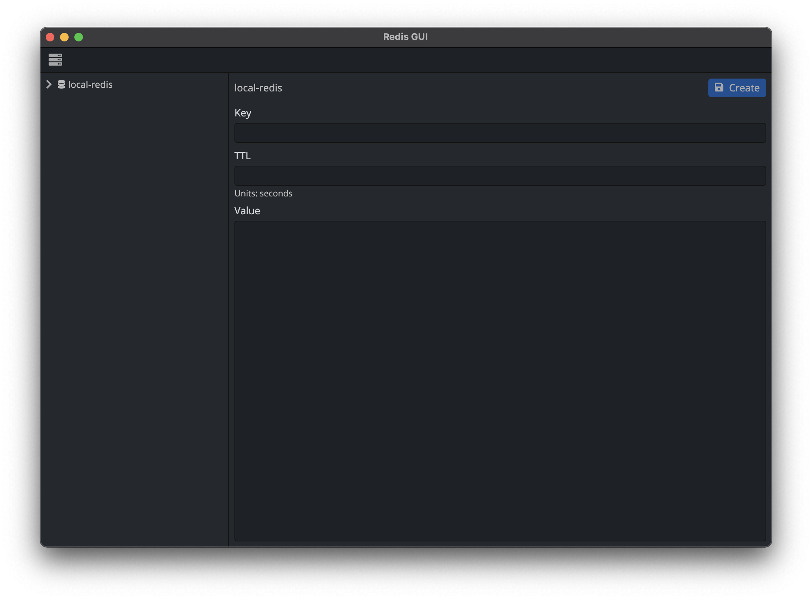

# Redis GUI

[](LICENSE)
[](http://makeapullrequest.com)

[](https://github.com/ezhivitsa/redis-gui/watchers)
[](https://github.com/ezhivitsa/redis-gui/stargazers)

Redis GUI is based on the following technologies:

- electron
- react
- mobx
- ioredis
- webpack
- postcss

### Functionality

1. Create/edit/delete direct, cluster or sentinel connections to Redis
2. Setting ssh and tls settings for connections
3. Viewing prefixes and keys in tree structure
4. Creating new keys and editing or deleting existing key values

### Screenshots

<table>
  <tr>
    <td>
      
    </td>
    <td>
      
    </td>
  </tr>
  <tr>
    <td>
      
    </td>
    <td>
      
    </td>
  </tr>
</table>

### Themes

According to the system theme we use appropriate theme (light or dark) in the applications:

<table>
  <tr>
    <td>
      
    </td>
    <td>
      
    </td>
  </tr>
</table>

### How to start development

Type the following command to install dependencies:
```bash
$ make deps
```

To run webpack and electron build and type the following command:
```bash
$ make dev
```

### How to make a build

To make a final build of js and css codebase type the following command:
```bash
$ make build
```

To make electron build of the whole release use the following command:
```bash
$ make electron-rebuild
```

### How to start tests

To start linting tests type the following command:
```bash
$ make lint
```

### Conventions

1. Name of all files for components should start from lowercase letter and words should be separated by a dash (date-range, multi-action-button).
2. Code style (eslint, typescript).
3. For css class names use BEM methodology.

## License

Redis GUI is released under the [MIT License](LICENSE).
